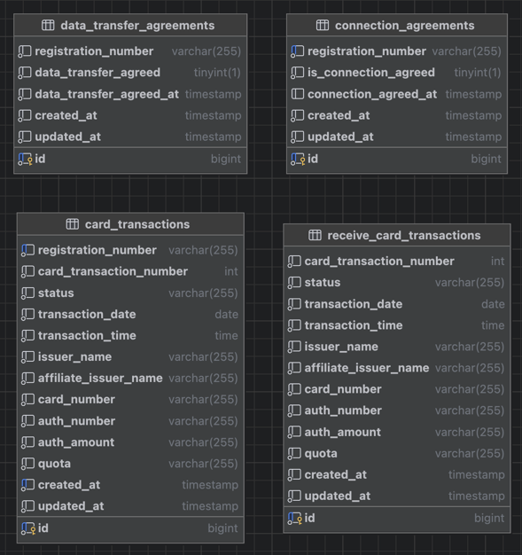

# Cash-Note 프로젝트 소개

## 폴더 구조

---

## ERD 소개

---

## 기술 스택

---

언어
- kotlin
- openjdk 21

프레임워크
- spring boot 3.2.1

데이터베이스
- Mysql 8.0

## 아키텍처
- 클린 아키텍처 일부 차용
- 도메인 주도 설계

### 패키지 구성
- 멀티 모듈 구성
  - cash-note
    - 캐시노트 클라이언트에 API 제공
  - data-transfer
    - spring scheduler 이용한 데이터 전송 프로세스
  - data-receiver
    - 데이터 수신 프로세스
- 멀티 모듈 구성 이유
  - 각 애플리케이션으로 분리
  - 스케일 아웃 시 용이

### 코드 구성

#### Application
- API Controller 계층
- 외부 요청 (External)
  - 외부에 데이터 전송 스케쥴링
- 내부 요청 (Internal)
  - 외부로부터 데이터 수신
- ApplicationService 의 경우, 요구 사항에 따른 비즈니스를 정의
  - UseCase 로서 활용
  - Domain, Infrastructure 계층 Service 를 의존한다.

#### Domain
- Domain Entity 로 Jpa Entity 활용
- ORM Entity 정의
  - 주체적인 행위를 가진다.
- Domain Service
  - Entity 가 자체적으로 행하지 못하는 도메인 비즈니스 정의

#### Infrastructure
- Persistence 의 JPA Repository 정의
- 외부 API, Library 관련 Configuration

#### Common
- 애플리케이션 내 필요한 공통 객체 정의
- App 내의 설정
- 공통 DTO & Constant & Util 

## 캐시 노트 API 소개

---

## 데이터 전송 프로세스

---

## 데이터 수신 프로세스

---

## 기술 선택 이유

