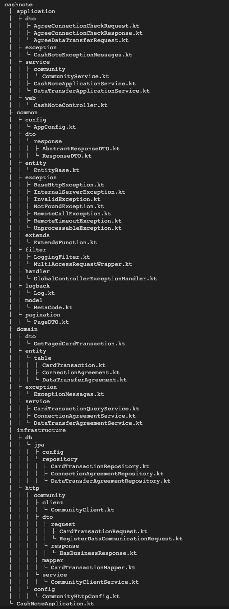

# Cash-Note 프로젝트 소개

## 폴더 구조

### cash-note module

### data-receiver module

### data-transfer

---

## ERD 소개

### data_transfer_agreements
- 데이터 전송 동의 내역 관리 Table
- registration_number unique_key 설정

### connection_agreements
- 간편 연결 동의 내역 관리 Table
- registration_number unique_key 설정

### card_transactions
- 카드 결제 데이터 Table
- 캐시 노트 내부 데이터 파이프라인을 통해 적재해 놓은 테이블이라 가정
- 사업자의 카드 데이터임을 확인하기 위해 registration_number 컬럼 추가
- registration_number 와 created_at 을 복합 인덱스로 설정
  - 카드 데이터 전송 시, 과거 6개월의 데이터를 조회하기 위해 사용

### receive_card_transactions
- 공동체 수신 카드 결제 데이터 Table
- 공동체로부터 수신 받은 카드 원장 데이터를 적재하기 위해 분리

---

## 기술 스택

---

언어
- kotlin
- jdk 21

프레임워크
- spring boot 3.2.1

데이터베이스
- Mysql 8.0

## 아키텍처
- 클린 아키텍처 일부 차용
- 도메인 주도 설계

### 패키지 구성
- 멀티 모듈 구성
  - cash-note
    - 캐시노트 클라이언트에 API 제공
  - data-transfer
    - spring scheduler 이용한 데이터 전송 프로세스
  - data-receiver
    - 데이터 수신 프로세스
- 멀티 모듈 구성 이유
  - 각 애플리케이션으로 분리
  - 스케일 아웃 시 용이

### 코드 구성

#### Application
- API Controller 계층
- 외부 요청 (External)
  - 외부에 데이터 전송 스케쥴링
- 내부 요청 (Internal)
  - 외부로부터 데이터 수신
- ApplicationService 의 경우, 요구 사항에 따른 비즈니스를 정의
  - UseCase 로서 활용
  - Domain, Infrastructure 계층 Service 를 의존한다.

#### Domain
- Domain Entity 로 Jpa Entity 활용
- ORM Entity 정의
  - 주체적인 행위를 가진다.
- Domain Service
  - Entity 가 자체적으로 행하지 못하는 도메인 비즈니스 정의

#### Infrastructure
- Persistence 의 JPA Repository 정의
- 외부 API, Library 관련 Configuration

#### Common
- 애플리케이션 내 필요한 공통 객체 정의
- App 내의 설정
- 공통 DTO & Constant & Util 

## 캐시 노트 API

간편 연결 확인 동의 API
- 공동체에 연결 확인 가능 API 동기 호출
- 연결 확인 동의 데이터 적재 Domain Service 함수 호출

데이터 제공 동의 API
- 간편 연결 동의 확인 후, 공동체에 데이터 전송 등록 API 동기 호출
- 데이터 제공 동의 내역 적재 Domain Service 함수 호출
- 과거 6개월 매출 조회 및 공동체에 매출 전송
  - 코루틴 활용 비동기 전송 프로세스 구성
  - 과거 6개월 매출 데이터는 방대할 것이므로, 10건 씩 페이징 처리하여 쿼리 후 10 건 배치 전송
  - DB 쿼리 부분 & 매출 데이터 전송 코드를 자식 코루틴으로 생성
  - while 문 활용하여, 반복 작업 진행 & 무한 루프 방지하기 위해 10분의 타임아웃 설정
  - 코루틴 예외 발생 시, 코루틴 작업 종료

---

## 데이터 전송 프로세스

데이터 전송 프로세스의 경우, Spring Scheduler 를 통해 구현  
역시 매출 데이터가 많을 것을 고려하여, 10건 씩 쿼리하여 배치 전송  
  
- 데이터 전송에 동의한 목록을 페이징 처리하여 조회
- 사업자 번호를 이용하여, 어제 카드 매출을 조회하여 10건 씩 Chunk 하여 공동체 배치 전송

---

## 데이터 수신 프로세스

이벤트 브로커로 카프카 선정  

카프카를 선정한 이유는, 
카드 매출 데이터를 대용량 데이터일 것으로 판단하여 무리 없이 수백만개의 메시지 처리 가능
파일 시스템을 사용하므로, 매출 데이터를 수신 받지 못하더라도, 유실을 방지할 수 있다는 이점이 있을 것이라 생각
  
카프카 리스너를 통해, 수신 받은 매출 데이터를 저장하는 프로세스로 구현

